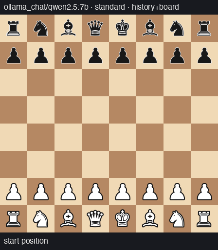
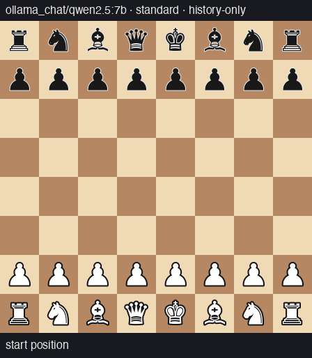
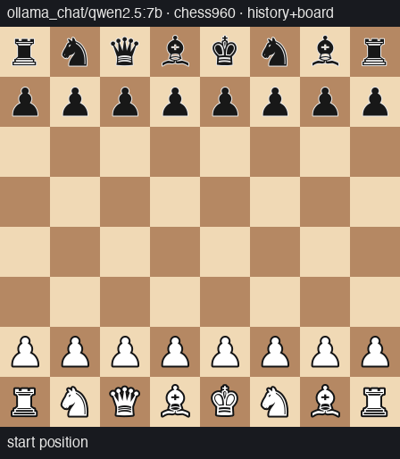
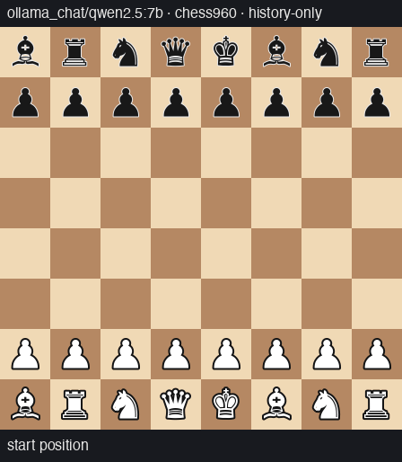
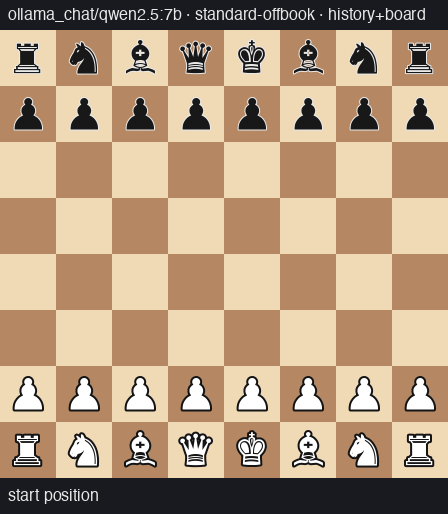
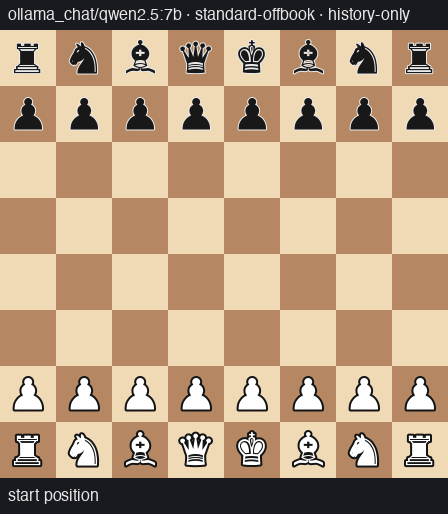

# chessbench

**When do LLMs start playing illegal chess moves — and why?**

An LLM plays chess against Stockfish. We measure the **time to its first
illegal-move attempt** as a survival outcome, across conditions chosen to
separate two explanations of LLM chess ability: *maintaining a mental model
of the board* vs *pattern-matching on memorized move sequences*.

## The experiment

Each game crosses two factors (pre-registered design, [PLAN.md](PLAN.md) §7):

| Factor | Levels | What it manipulates |
|---|---|---|
| **Board visibility** | `history+board` (current FEN + diagram every turn) vs `history-only` (blindfold: start position + move list) | whether the model must *track* state or is *given* it |
| **Variant** | `standard` vs `chess960` (shuffled back rank) vs `standard-offbook` (standard rules, random 6-ply opening) | whether memorized openings apply; offbook is the bridge that separates *off-book* from *off-geometry* |

The opponent is weakened Stockfish (skill 3, node-capped) so games last long
enough to measure. The primary event is the first illegal-or-ambiguous
attempt, on the LLM-move-index time scale. **The model plays both colors:**
every cell is split 50/50 White/Black (alternating, decorrelated from start
positions), color enters the Cox model as a covariate, and color equivalence
is a pre-registered hypothesis (H1). Retries, forfeit rules, censoring, and
the analysis model (cause-specific Cox with a pre-registered
blindfold×chess960 interaction) are all frozen in the prereg before data
collection. An **error taxonomy** classifies each illegal attempt, including
the `phantom-standard` class: a move that would have been *legal* if the
same movetext had been played from the standard starting position — the
direct signature of pattern-matching on standard-chess geometry.

## Results so far (local pilots, 120 games per model)

### qwen2.5:7b — the first tier with real separation


| Pre-registered test | Result |
|---|---|
| **Chess960 effect (H3)** | **HR 3.00**, 90% CI [1.46, 6.16], p = .012 — shuffled geometry triples the illegal-move hazard |
| **Off-book effect** | **HR 3.27**, 90% CI [1.30, 8.24], p = .035 — a random opening *alone* also triples it |
| **Geometry beyond off-book** | ≈ nothing — the two effects are statistically indistinguishable: leaving the memorized move distribution, not the unfamiliar board, is what breaks the model |
| **Blindfold main effect (H2)** | HR 0.71, p = .11 (n.s.) — trend *protective*: history-only play is, if anything, easier than reading a board diagram |
| **Blindfold×960 interaction (H4)** | HR 1.45, p = .28 — positive (the pattern-matching prediction) but underpowered at 20 games/cell |
| **Color equivalence (H1)** | HR(black) 0.94, CI [0.65, 1.37] — inconclusive at this tier |

**The mechanism finding:** 47 illegal attempts in the chess960 cells were
`phantom-standard` — legal moves *on the board that wasn't there* — versus
**zero** in every other variant. Blindfolded, the phantom rate **doubles**
(31 vs 16): without a board in view, the model reverts to its memorized
standard-chess geometry twice as often. Full report:
[docs/results/qwen25-7b-pilot](docs/results/qwen25-7b-pilot/report.md).

### qwen2.5:3b — below the benchmark's floor

Median first event at move 1–2 in every cell; condition effects
unidentifiable (as the pre-registration's power analysis anticipated for
weak models), though color equivalence formally held (HR 1.02, CI
[0.70, 1.48]) and phantom-standard errors again appeared *only* in
chess960 cells. Report:
[docs/results/qwen25-pilot](docs/results/qwen25-pilot/report.md).

### Example games (qwen2.5:7b, longest game per cell)

Red frames show failed attempts — what the model tried, and the failure
class — before each ply resolved.

<table>
<tr><th></th><th>board shown</th><th>blindfold</th></tr>
<tr><th>standard</th>
<td></td>
<td></td></tr>
<tr><th>chess960</th>
<td></td>
<td></td></tr>
<tr><th>offbook</th>
<td></td>
<td></td></tr>
</table>

## Validity engineering

The harness treats measurement validity as the product. Notable guards, each
added after a failure that would otherwise have silently poisoned data:

- **Staged move extraction** (`MOVE:` protocol → inline → `\boxed{}` →
  bare-SAN last line), so format compliance isn't confounded with chess
  ability; every attempt records its extraction stage for strict-protocol
  sensitivity analyses. A strict parser was demonstrably *suppressing the
  benchmark's own signal* (misclassifying real illegal attempts as format
  noise).
- **Infrastructure quarantine**: truncation, context-window overflow, and
  dead-server empty responses are never graded as chess; persistent cases
  censor or abort, and censoring is reported per cell (it is
  condition-correlated — hard positions provoke longer generations).
- **Context-shifting guard**: ollama models can't run without an explicit,
  sufficient context window (its silent 4096 default drops the system
  prompt mid-generation); per-attempt token accounting flags any overflow.
- **Startup health probe + circuit breaker + self-healing supervisor**
  (`scripts/run_supervised.sh`): a crashed local GPU backend becomes a loud
  restart-and-resume, not fake forfeits.
- **Self-documenting records**: every game logs the verbatim system prompt
  and per-attempt request prompts; the wire-level engine config
  (UCI_Chess960 etc.) was verified against the UCI protocol stream.

## Running it

```sh
brew install stockfish && uv sync
# local model via ollama:
uv run chessbench --model ollama_chat/qwen2.5:7b --games-per-cell 20 --variant all --out runs/mine
# API model via litellm (set the provider key):
uv run chessbench --model anthropic/claude-sonnet-5 --games-per-cell 30 --out runs/sonnet

# pre-registered analysis (KM, hazard, Cox, taxonomy):
uv sync --extra analysis && uv run chessbench-analyze runs/mine

# visualizations:
uv run chessbench-viz runs/mine        # interactive HTML viewer
uv run chessbench-anim runs/mine       # GIF per game
```

Runs are resumable (completed games are never replayed), parallelizable
(`--parallel`), and long local runs should use
`scripts/run_supervised.sh <out_dir> <args...>` for self-healing.
Offline dry runs: `--model fake:random`. Tests: `uv run pytest` (83 tests).

## Roadmap

- More games/cell at 7B for H4 power; a 14B local tier.
- Frontier-model arm via API (the design is provider-agnostic through
  litellm).
- Thinking-mode arm (qwen3-class models think unboundedly on hard
  positions — itself a documented observation — so this arm needs API
  models or bigger hardware).
- State-probe side-queries and CPL-from-PGN analyses per the prereg's
  planned additions.
