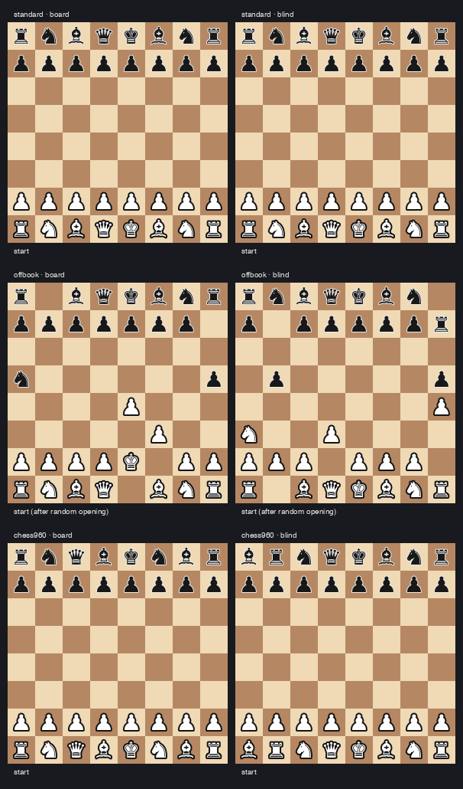

# chessbench

**When do LLMs start playing illegal chess moves — and why?**

An LLM plays chess against Stockfish. We measure the **time to its first
illegal-move attempt** as a survival outcome, across conditions chosen to
separate two explanations of LLM chess ability: *maintaining a mental model
of the board* vs *pattern-matching on memorized move sequences*.

## The experiment

A 2 × 3 factorial (pre-registered design, [PLAN.md](PLAN.md) §7): three game
types that progressively remove things the model might be relying on —

| | `standard` | `standard-offbook` | `chess960` |
|---|:---:|:---:|:---:|
| memorized openings apply | ✓ | ✗ | ✗ |
| familiar board geometry | ✓ | ✓ | ✗ |

(`standard-offbook` = normal chess with a seeded random 6-ply opening;
`chess960` = shuffled back rank) — each crossed with **board visibility**:

- **board shown** — the current FEN + diagram is in every prompt (state is *given*)
- **blindfold** — move history only (state must be *tracked*, or pattern-matched around)

The contrasts then read straight off the design: `standard → offbook`
isolates losing the book; `offbook → chess960` isolates losing the
geometry; `board → blindfold` isolates losing explicit state.

The opponent is weakened Stockfish (skill 3, node-capped) so games last long
enough to measure. The primary event is the first illegal-or-ambiguous
attempt, on the LLM-move-index time scale. **The model plays both colors:**
every cell is split 50/50 White/Black (alternating, decorrelated from start
positions), color enters the Cox model as a covariate, and color equivalence
is a pre-registered hypothesis (H1). Retries, forfeit rules, censoring, and
the analysis model (cause-specific Cox with a pre-registered
blindfold×chess960 interaction) are all frozen in the prereg before data
collection. An **error taxonomy** classifies each illegal attempt, including
the `phantom-standard` class: a move that would have been *legal* if the
same movetext had been played from the standard starting position — the
direct signature of pattern-matching on standard-chess geometry.

### What the model actually sees

Every prompt is logged verbatim in the game records; these are real examples
from a logged game. The **system prompt** (constant within a game):

```text
You are playing a game of chess against an opponent. This is a game of standard chess, played from the normal starting position.

You are playing Black.

On each turn, decide on your move and reply with it in standard algebraic notation (SAN). You may reason briefly first, but the final line of your reply must have exactly this format:
MOVE: <your move>

Examples: "MOVE: e4", "MOVE: Nf3", "MOVE: O-O", "MOVE: exd8=Q+".

If a move could be made by more than one of your pieces, disambiguate it with the originating file or rank (e.g. "MOVE: Nbd2", "MOVE: R1e2").

Only legal moves are accepted.
```

(Chess960 games get an extra paragraph explaining the shuffled start and 960
castling; offbook games are told the opening was played by a neutral
randomizer.) Each turn, the **move request** in the `board shown` condition:

```text
Starting position (FEN): rnbqkbnr/pppppppp/8/8/8/8/PPPPPPPP/RNBQKBNR w KQkq - 0 1
Moves played so far: 1. Nf3 e5 2. e4 d5 3. d4

Current position (FEN): rnbqkbnr/ppp2ppp/8/3pp3/3PP3/5N2/PPP2PPP/RNBQKB1R b KQkq - 0 3
Current board (uppercase = White, lowercase = Black):
8 | r n b q k b n r
7 | p p p . . p p p
6 | . . . . . . . .
5 | . . . p p . . .
4 | . . . P P . . .
3 | . . . . . N . .
2 | P P P . . P P P
1 | R N B Q K B . R
  +----------------
    a b c d e f g h

It is your move — you are Black (move 3). Reply with your move, ending with the line 'MOVE: <san>'.
```

The **blindfold** condition is identical minus the `Current position` /
`Current board` block — the model gets the starting FEN and the move list,
nothing else. (Chess960 positions use Shredder-FEN castling fields, e.g.
`HChc` instead of `KQkq`.) **An illegal or ambiguous attempt ends the game
immediately** — it *is* the survival event being measured. Only
format-invalid replies (no parseable move at all) get a minimal retry
message, up to 3 attempts, then the game is forfeit; retry feedback is
deliberately identical in information content across conditions, so it
never leaks board state into the blindfold cells.

## Results so far (local pilots, 120 games per model)

### qwen2.5:7b — the first tier with real separation


#### How to read the numbers

The **hazard** is the per-move risk of the first illegal attempt: the
probability the model commits one at move $k$ given it hasn't yet,

```math
h(k) \;=\; \Pr\big(\text{first illegal attempt at move } k \,\big|\, \text{no illegal attempt before } k\big).
```

The Cox model assumes each condition multiplies a shared baseline risk
$h_0(k)$ by a constant:

```math
h(k \mid x) \;=\; h_0(k)\,\exp\big(\beta_1\,\mathrm{blind} + \beta_2\,\mathrm{960} + \beta_3\,\mathrm{offbook} + \beta_4\,\mathrm{blind{\times}960} + \beta_5\,\mathrm{blind{\times}offbook} + \beta_6\,\mathrm{Black}\big),
```

and the **hazard ratio** for factor $j$ is that multiplier:

```math
\mathrm{HR}_j \;=\; e^{\beta_j} \;=\; \frac{h(k \mid x_j{=}1)}{h(k \mid x_j{=}0)}.
```

$\mathrm{HR} > 1$ means the first illegal move arrives sooner than in the
baseline cell (standard chess, board shown, playing White); $\mathrm{HR} = 1$
means no effect. Survival framing is used because it handles censored games
and unequal exposure correctly — "% of games with an illegal move" would
conflate failing fast with playing long.

**Confidence intervals.** The Cox CIs are Wald intervals on the log-hazard
scale with **cluster-robust (sandwich) standard errors**, clustered on the
start position/prefix — games sharing a start position are not independent,
and naive SEs would overstate precision:

```math
\mathrm{CI}_{90\%}(\mathrm{HR}_j) \;=\; \exp\!\big(\hat\beta_j \pm 1.645\,\widehat{\mathrm{SE}}_{\mathrm{cluster}}(\hat\beta_j)\big).
```

The 90% level is deliberate: H1 is an equivalence test, and by the
two-one-sided-tests (TOST) convention, "90% CI entirely inside the margin"
is an $\alpha = 0.05$ equivalence test — so one interval serves both the
difference tests and the equivalence test. The mean-survival figure uses a
different construction: a nonparametric percentile bootstrap (games
resampled with replacement within each cell, 500 seeded replicates,
5th–95th percentiles).

#### Pre-registered tests (qwen2.5:7b, 90% CIs)

| Test | HR | 90% CI | p | Reading |
|---|---:|:---:|---:|---|
| chess960 (H3) | **3.00** | [1.46, 6.16] | .012 | shuffled start **triples** per-move risk |
| offbook | **3.27** | [1.30, 8.24] | .035 | a random opening *alone* does the same — off-book, not geometry, breaks the model |
| blindfold (H2) | 0.71 | [0.50, 1.01] | .11 | trend *protective*: history-only ≤ risk of board-shown |
| blindfold × 960 (H4) | 1.45 | [0.83, 2.52] | .28 | positive (pattern-matching prediction), underpowered at 20/cell |
| blindfold × offbook | 0.67 | [0.29, 1.54] | .43 | inconclusive |
| plays Black (H1) | 0.94 | [0.65, 1.37] | — | equivalence vs margin [0.67, 1.5]: inconclusive at this tier |

**No game in either pilot ended in checkmate** — all 240 ended by forfeit (three failed attempts at one position); the model always breaks on
legality before the engine can break it on chess.

**The mechanism finding:** 47 of the 191 illegal attempts in the 40
chess960 games were
`phantom-standard` — legal moves *on the board that wasn't there* — versus
**zero** in every other variant. Blindfolded, the phantom rate **doubles**
(31 vs 16): without a board in view, the model reverts to its memorized
standard-chess geometry twice as often. Full report:
[docs/results/qwen25-7b-pilot](docs/results/qwen25-7b-pilot/report.md).
(These pilots pre-date the halt-at-first-illegal rule, so a game could
contribute several illegal attempts; under the current rule each game
contributes at most one.)

### qwen2.5:3b — below the benchmark's floor

Median first event at move 1–2 in every cell; condition effects
unidentifiable (as the pre-registration's power analysis anticipated for
weak models), though color equivalence formally held (HR 1.02, CI
[0.70, 1.48]) and phantom-standard errors again appeared *only* in
chess960 cells. Report:
[docs/results/qwen25-pilot](docs/results/qwen25-pilot/report.md).

### Example games (qwen2.5:7b, longest game per cell)

One synchronized animation — **qwen plays White on every board** (labeled,
with each move attributed to qwen or Stockfish): all six cells advance
together on a shared move clock, and **each board freezes at its first illegal attempt** — the piece is
shown moved to its intended square, with both the origin and destination
squares in red and the tried SAN in the caption — while
the surviving games play on (yellow = moves actually played). Watching
the boards die one by one *is* the result. Generated with
`chessbench-anim --combined`. Offbook boards start from their
post-random-opening position — frame one is the first decision the model
actually makes, in every cell.




## Validity engineering

The harness treats measurement validity as the product. Notable guards, each
added after a failure that would otherwise have silently poisoned data:

- **Staged move extraction** (`MOVE:` protocol → inline → `\boxed{}` →
  bare-SAN last line), so format compliance isn't confounded with chess
  ability; every attempt records its extraction stage for strict-protocol
  sensitivity analyses. A strict parser was demonstrably *suppressing the
  benchmark's own signal* (misclassifying real illegal attempts as format
  noise).
- **Infrastructure quarantine**: truncation, context-window overflow, and
  dead-server empty responses are never graded as chess; persistent cases
  censor or abort, and censoring is reported per cell (it is
  condition-correlated — hard positions provoke longer generations).
- **Context-shifting guard**: ollama models can't run without an explicit,
  sufficient context window (its silent 4096 default drops the system
  prompt mid-generation); per-attempt token accounting flags any overflow.
- **Startup health probe + circuit breaker + self-healing supervisor**
  (`scripts/run_supervised.sh`): a crashed local GPU backend becomes a loud
  restart-and-resume, not fake forfeits.
- **Self-documenting records**: every game logs the verbatim system prompt
  and per-attempt request prompts; the wire-level engine config
  (UCI_Chess960 etc.) was verified against the UCI protocol stream.

## Running it

```sh
brew install stockfish && uv sync
# local model via ollama:
uv run chessbench --model ollama_chat/qwen2.5:7b --games-per-cell 20 --variant all --out runs/mine
# API model via litellm (set the provider key):
uv run chessbench --model anthropic/claude-sonnet-5 --games-per-cell 30 --out runs/sonnet

# pre-registered analysis (KM, hazard, Cox, taxonomy):
uv sync --extra analysis && uv run chessbench-analyze runs/mine

# visualizations:
uv run chessbench-viz runs/mine        # interactive HTML viewer
uv run chessbench-anim runs/mine       # GIF per game
```

Runs are resumable (completed games are never replayed), parallelizable
(`--parallel`), and long local runs should use
`scripts/run_supervised.sh <out_dir> <args...>` for self-healing.
Offline dry runs: `--model fake:random`. Tests: `uv run pytest` (83 tests).

## Roadmap

- More games/cell at 7B for H4 power; a 14B local tier.
- Frontier-model arm via API (the design is provider-agnostic through
  litellm).
- Thinking-mode arm (qwen3-class models think unboundedly on hard
  positions — itself a documented observation — so this arm needs API
  models or bigger hardware).
- State-probe side-queries and CPL-from-PGN analyses per the prereg's
  planned additions.
