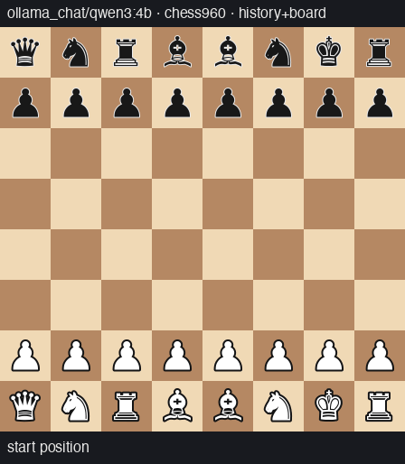
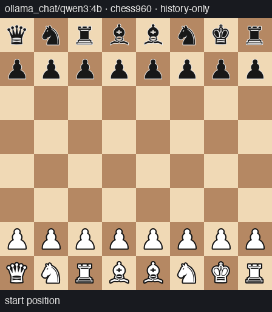

# chessbench

Benchmark measuring **time-to-first-illegal-move** for LLMs playing chess
against Stockfish, across a 2×2 design:

- **Board visibility:** `history-only` (blindfold: start FEN + SAN move list)
  vs `history+board` (plus current FEN and ASCII board each turn)
- **Variant:** `standard` vs `chess960` (fixed seeded set of Fischer Random
  start positions, paired across cells)

Full design rationale, prior-art survey, and analysis plan: [PLAN.md](PLAN.md).

## Example games (qwen3:4b pilot, one game per cell)

Red frames show the model's failed attempts (what it tried, and the failure
class) before the ply resolved. Generated with `chessbench-anim`.

<table>
<tr>
<th></th>
<th>board shown each turn</th>
<th>blindfold (history only)</th>
</tr>
<tr>
<th>standard</th>
<td><br><sub>survived to the 20-ply cap; first illegal attempt at ply 13</sub></td>
<td><br><sub>forfeit at ply 10; first illegal attempt at ply 9</sub></td>
</tr>
<tr>
<th>chess960</th>
<td><br><sub>censored at ply 4: thinking exhausted the token budget</sub></td>
<td><br><sub>forfeit at ply 2; first illegal attempt at ply 3</sub></td>
</tr>
</table>

For interactive playback (move list, raw model output per failed attempt),
generate the self-contained HTML viewer: `uv run chessbench-viz runs/<name>`.

## Setup

```sh
brew install stockfish
uv sync
```

Real models go through [litellm](https://docs.litellm.ai/docs/providers), so
set the relevant key (`ANTHROPIC_API_KEY`, `OPENAI_API_KEY`, …) and use its
model strings.

## Usage

```sh
# Offline dry run of the full 2x2 (no API keys needed):
uv run chessbench --model fake:random --games-per-cell 2 --out runs/smoke

# List the planned games for a real run without playing:
uv run chessbench --model anthropic/claude-sonnet-5 --list

# The real thing:
uv run chessbench --model anthropic/claude-sonnet-5 --games-per-cell 30 --out runs/main
```

Runs are resumable: a game whose JSONL already contains its final
`{"type": "game"}` record is skipped, so re-running the same command
continues where it left off.

## Output

Per game, in `--out`:

- `<game_id>.jsonl` — one record per LLM move attempt (raw output, parse
  class `legal|illegal|ambiguous|invalid`, FEN before, eval, tokens,
  latency), engine moves, and a final `{"type": "game"}` summary record
  (termination, survival ply, censoring status).
- `<game_id>.pgn` — the game, with FEN/variant headers for Chess960.
- `manifest-<timestamp>.json` — full run configuration, engine version,
  position set and seeds.

Failure taxonomy maps 1:1 onto python-chess exceptions: `invalid`
(unparseable), `illegal` (well-formed but illegal), `ambiguous`
(underspecified SAN). The survival event is the *first* illegal-or-ambiguous
attempt; retries (default 3 per ply, with minimal feedback that never leaks
board state) only affect game continuation. Truncated responses
(`finish_reason=length`) are an infrastructure category: retried, never
graded as chess failures, and persistent truncation censors the game
(`censored_infra`) rather than recording a loss — raise `--max-tokens` for
reasoning models.

## Tests

```sh
uv run pytest
```

Engine integration tests are skipped automatically if `stockfish` is not on
`PATH`.
