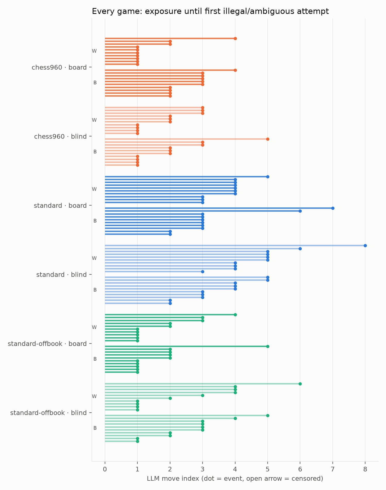
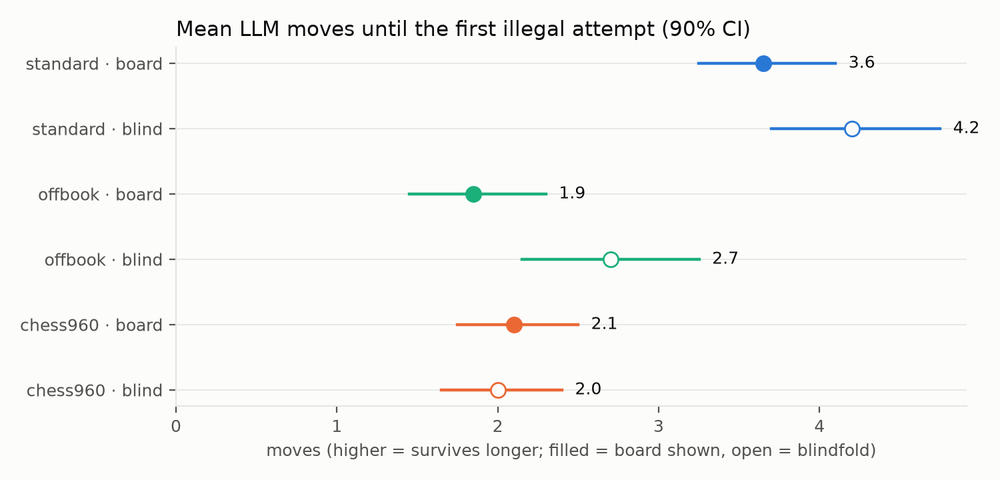
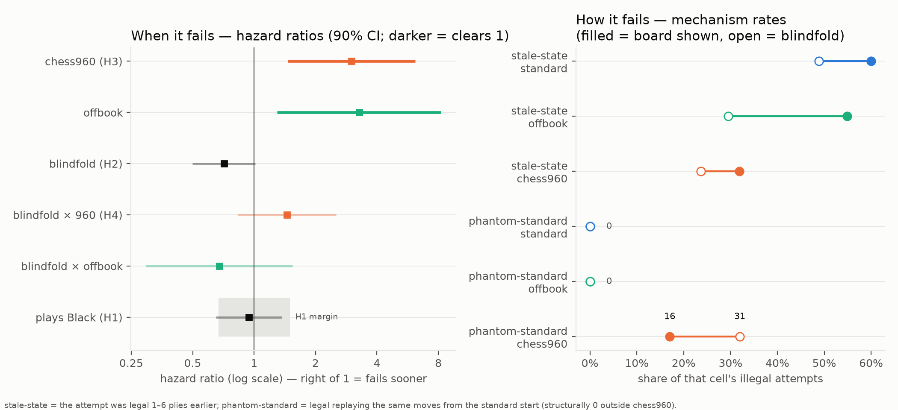
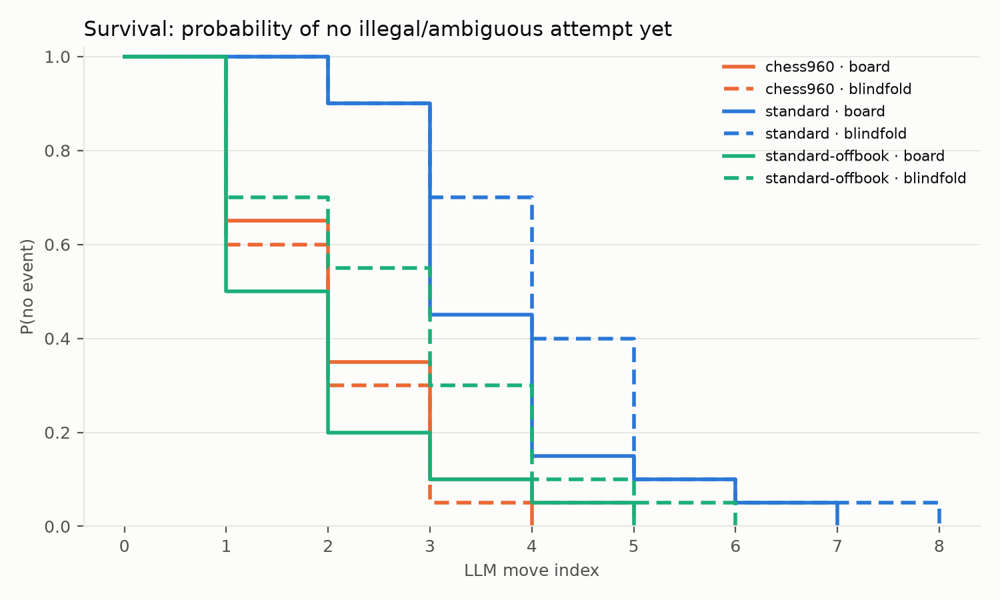
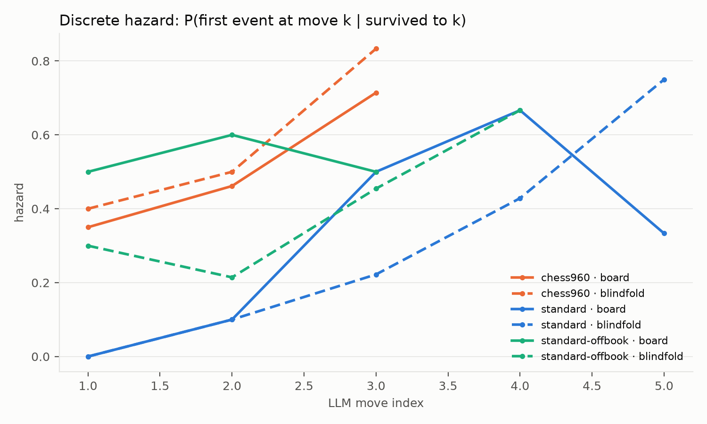

# chessbench analysis

Runs: runs/qwen25-7b-pilot  
Games: 120 analyzable / 120 total · models: ollama_chat/qwen2.5:7b

Pre-registered analysis per PLAN.md §7 (time scale: LLM move index; event: first illegal-or-ambiguous attempt).

## Per-cell summary

| cell | games | events | median event move | median exposure |
|---|---|---|---|---|
| chess960 × history+board | 20 | 20 | 2 | 2 |
| chess960 × history-only | 20 | 20 | 2 | 2 |
| standard × history+board | 20 | 20 | 3 | 3 |
| standard × history-only | 20 | 20 | 4 | 4 |
| standard-offbook × history+board | 20 | 20 | 2 | 2 |
| standard-offbook × history-only | 20 | 20 | 3 | 3 |

## Cox model (cause-specific, cluster-robust by position/prefix)

| covariate | log-HR | HR | 90% CI | p |
|---|---|---|---|---|
| blind | -0.341 | 0.71 | [0.50, 1.01] | 0.113 |
| v960 | 1.098 | 3.00 | [1.46, 6.16] | 0.0121 |
| voffbook | 1.185 | 3.27 | [1.30, 8.24] | 0.0351 |
| blind_x_960 | 0.369 | 1.45 | [0.83, 2.52] | 0.275 |
| blind_x_offbook | -0.394 | 0.67 | [0.29, 1.54] | 0.434 |
| black | -0.060 | 0.94 | [0.65, 1.37] | 0.79 |

H4 is the `blind_x_960` row: positive log-HR = blindfold hurts more in chess960 than in standard (the pattern-matching prediction).

_CIs: Wald intervals on log-HR with cluster-robust (sandwich) SEs clustered by start position/prefix, exp-transformed; 90% level chosen so the H1 equivalence test follows the TOST convention (90% CI inside the margin = alpha 0.05 equivalence)._

**H1 color equivalence:** HR(black) = 0.94, 90% CI [0.65, 1.37] vs margin [0.67, 1.5] → inconclusive (CI overlaps the margin boundary)

## Color control (White vs Black, per cell)

| cell | as White: n (events, median move) | as Black: n (events, median move) |
|---|---|---|
| chess960 × history+board | 10 (10 ev, med 1) | 10 (10 ev, med 3) |
| chess960 × history-only | 10 (10 ev, med 2) | 10 (10 ev, med 2) |
| standard × history+board | 10 (10 ev, med 4) | 10 (10 ev, med 3) |
| standard × history-only | 10 (10 ev, med 5) | 10 (10 ev, med 4) |
| standard-offbook × history+board | 10 (10 ev, med 2) | 10 (10 ev, med 2) |
| standard-offbook × history-only | 10 (10 ev, med 2) | 10 (10 ev, med 3) |

_Color is balanced within every cell and enters the Cox model as the `black` covariate; H1 (equivalence) above is the formal test._

## Censoring / termination by cause (per cell)

| cell | llm_forfeit |
|---|---|
| chess960 × history+board | 20 |
| chess960 × history-only | 20 |
| standard × history+board | 20 |
| standard × history-only | 20 |
| standard-offbook × history+board | 20 |
| standard-offbook × history-only | 20 |

_`llm_forfeit` rows with no illegal/ambiguous attempt are format forfeits (censoring); truncation is infrastructure censoring. Both are condition-correlated risks — watch these columns._

_No context-overflow attempts detected._

## Illegal-move error taxonomy

| cell | (phantom-standard) | (stale-state) | illegal-castling | into-check-or-pin | own-piece-capture | piece-cannot-reach |
|---|---|---|---|---|---|---|
| chess960 × history+board | 16 | 30 | 1 | 2 | 9 | 82 |
| chess960 × history-only | 31 | 23 | 1 | 1 | 3 | 92 |
| standard × history+board | 0 | 51 | 0 | 2 | 7 | 76 |
| standard × history-only | 0 | 43 | 0 | 3 | 11 | 74 |
| standard-offbook × history+board | 0 | 56 | 0 | 4 | 16 | 82 |
| standard-offbook × history-only | 0 | 28 | 0 | 2 | 20 | 73 |

_`(phantom-standard)` counts chess960 illegal attempts that would have been LEGAL replaying the same movetext from the standard start — the direct signature of standard-geometry pattern matching. `(stale-state)` counts attempts legal at a position 1–6 plies earlier — state-tracking lag; in board-shown cells these contradict the very board displayed in the prompt._

## Sensitivity: illegal-only events

| cell | games | events | median event move |
|---|---|---|---|
| chess960 × history+board | 20 | 20 | 2 |
| chess960 × history-only | 20 | 20 | 2 |
| standard × history+board | 20 | 20 | 3 |
| standard × history-only | 20 | 20 | 4 |
| standard-offbook × history+board | 20 | 20 | 2 |
| standard-offbook × history-only | 20 | 20 | 3 |
