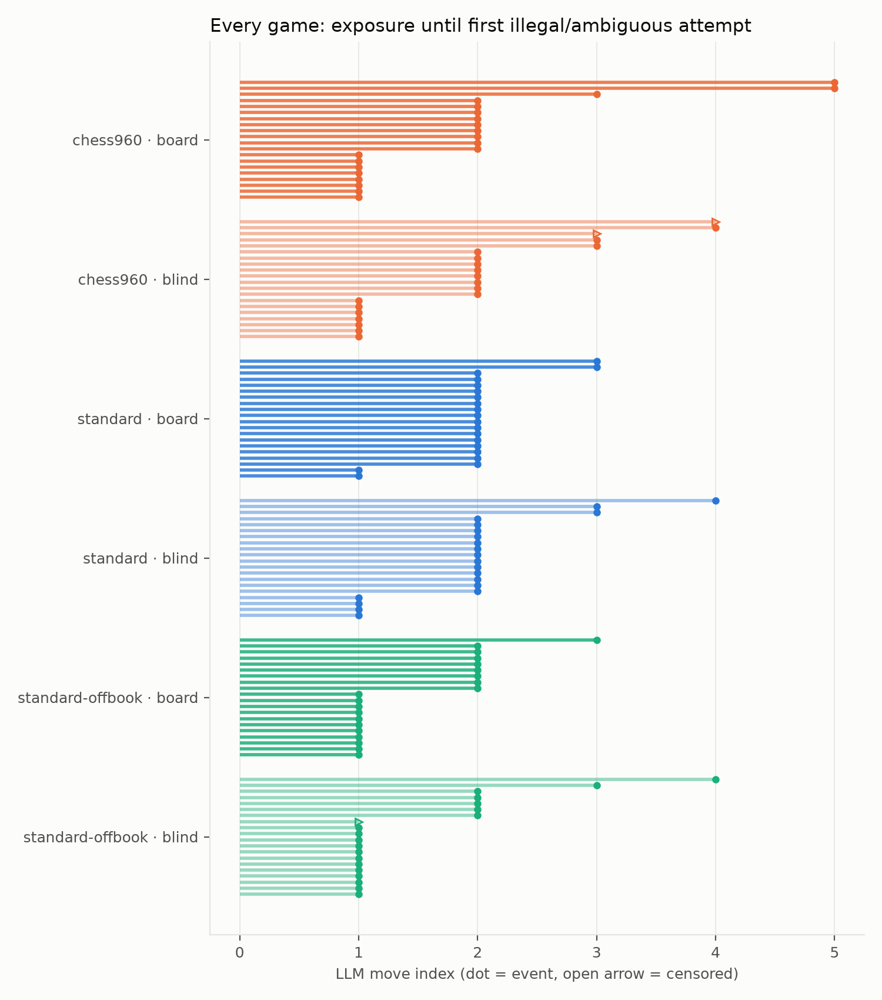
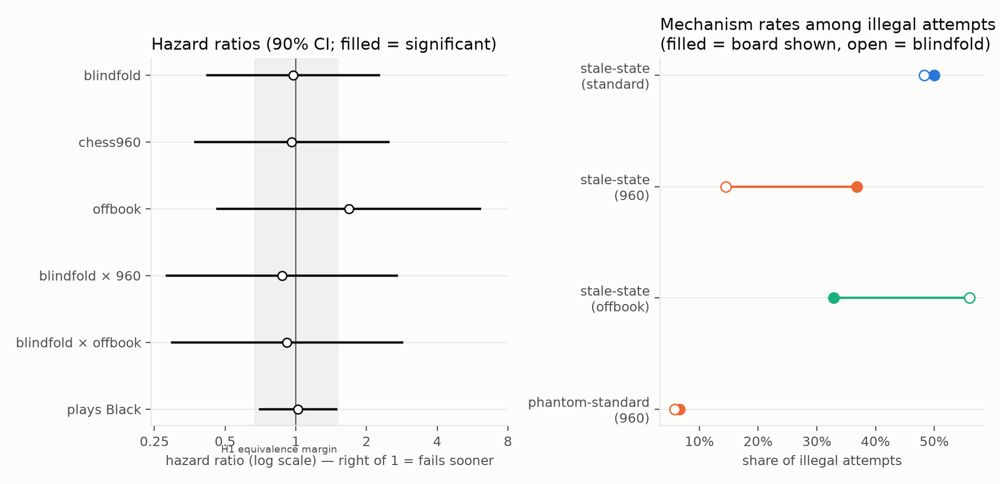
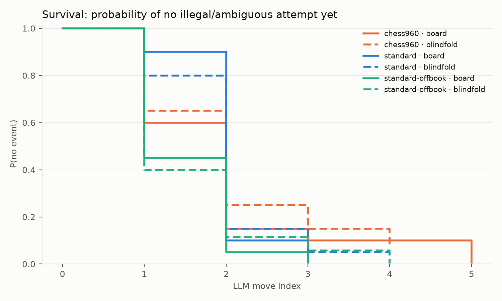
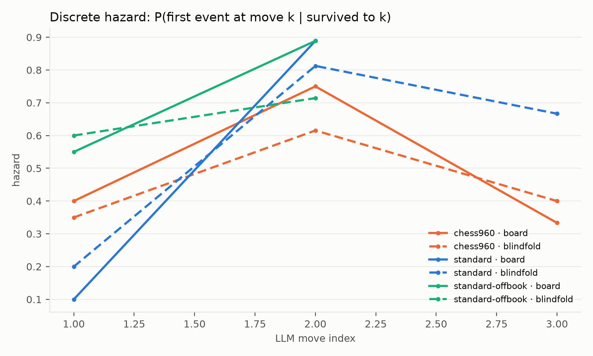

# chessbench analysis

Runs: runs/qwen25-pilot  
Games: 120 analyzable / 120 total · models: ollama_chat/qwen2.5:3b

Pre-registered analysis per PLAN.md §7 (time scale: LLM move index; event: first illegal-or-ambiguous attempt).

## Per-cell summary

| cell | games | events | median event move | median exposure |
|---|---|---|---|---|
| chess960 × history+board | 20 | 20 | 2 | 2 |
| chess960 × history-only | 20 | 18 | 2 | 2 |
| standard × history+board | 20 | 20 | 2 | 2 |
| standard × history-only | 20 | 20 | 2 | 2 |
| standard-offbook × history+board | 20 | 20 | 1 | 1 |
| standard-offbook × history-only | 20 | 19 | 1 | 1 |

## Cox model (cause-specific, cluster-robust by position/prefix)

| covariate | log-HR | HR | 90% CI | p |
|---|---|---|---|---|
| blind | -0.027 | 0.97 | [0.42, 2.26] | 0.958 |
| v960 | -0.039 | 0.96 | [0.37, 2.48] | 0.945 |
| voffbook | 0.518 | 1.68 | [0.46, 6.10] | 0.509 |
| blind_x_960 | -0.135 | 0.87 | [0.28, 2.70] | 0.843 |
| blind_x_offbook | -0.086 | 0.92 | [0.30, 2.83] | 0.901 |
| black | 0.021 | 1.02 | [0.70, 1.48] | 0.926 |

H4 is the `blind_x_960` row: positive log-HR = blindfold hurts more in chess960 than in standard (the pattern-matching prediction).

**H1 color equivalence:** HR(black) = 1.02, 90% CI [0.70, 1.48] vs margin [0.67, 1.5] → EQUIVALENT within the pre-registered margin

## Color control (White vs Black, per cell)

| cell | as White: n (events, median move) | as Black: n (events, median move) |
|---|---|---|
| chess960 × history+board | 10 (10 ev, med 2) | 10 (10 ev, med 2) |
| chess960 × history-only | 10 (8 ev, med 2) | 10 (10 ev, med 1) |
| standard × history+board | 10 (10 ev, med 2) | 10 (10 ev, med 2) |
| standard × history-only | 10 (10 ev, med 2) | 10 (10 ev, med 2) |
| standard-offbook × history+board | 10 (10 ev, med 1) | 10 (10 ev, med 2) |
| standard-offbook × history-only | 10 (10 ev, med 1) | 10 (9 ev, med 2) |

_Color is balanced within every cell and enters the Cox model as the `black` covariate; H1 (equivalence) above is the formal test._

## Censoring / termination by cause (per cell)

| cell | llm_forfeit |
|---|---|
| chess960 × history+board | 20 |
| chess960 × history-only | 20 |
| standard × history+board | 20 |
| standard × history-only | 20 |
| standard-offbook × history+board | 20 |
| standard-offbook × history-only | 20 |

_`llm_forfeit` rows with no illegal/ambiguous attempt are format forfeits (censoring); truncation is infrastructure censoring. Both are condition-correlated risks — watch these columns._

_No context-overflow attempts detected._

## Illegal-move error taxonomy

| cell | (phantom-standard) | (stale-state) | illegal-castling | into-check-or-pin | own-piece-capture | piece-cannot-reach |
|---|---|---|---|---|---|---|
| chess960 × history+board | 5 | 28 | 12 | 0 | 4 | 60 |
| chess960 × history-only | 4 | 10 | 22 | 0 | 5 | 42 |
| standard × history+board | 0 | 32 | 19 | 1 | 1 | 43 |
| standard × history-only | 0 | 43 | 31 | 0 | 3 | 55 |
| standard-offbook × history+board | 0 | 22 | 24 | 1 | 2 | 40 |
| standard-offbook × history-only | 0 | 42 | 11 | 1 | 13 | 50 |

_`(phantom-standard)` counts chess960 illegal attempts that would have been LEGAL replaying the same movetext from the standard start — the direct signature of standard-geometry pattern matching. `(stale-state)` counts attempts legal at a position 1–6 plies earlier — state-tracking lag; in board-shown cells these contradict the very board displayed in the prompt._

## Sensitivity: illegal-only events

| cell | games | events | median event move |
|---|---|---|---|
| chess960 × history+board | 20 | 20 | 2 |
| chess960 × history-only | 20 | 18 | 2 |
| standard × history+board | 20 | 20 | 2 |
| standard × history-only | 20 | 20 | 2 |
| standard-offbook × history+board | 20 | 20 | 1 |
| standard-offbook × history-only | 20 | 19 | 1 |
