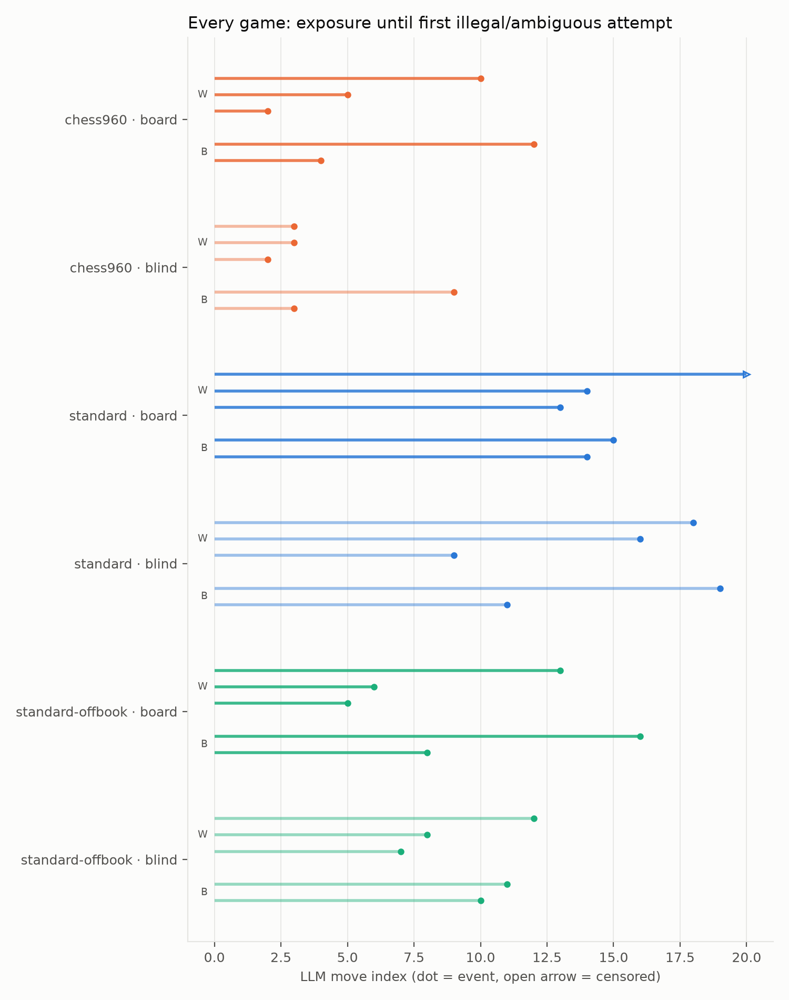
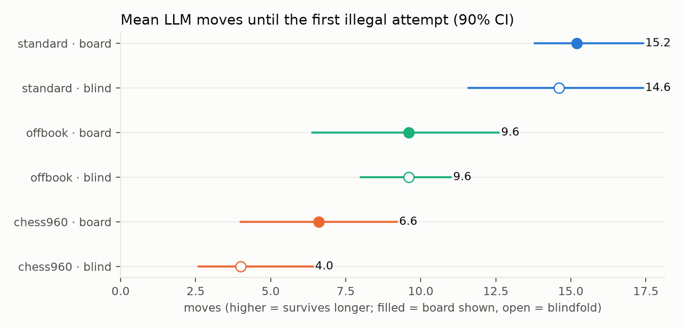
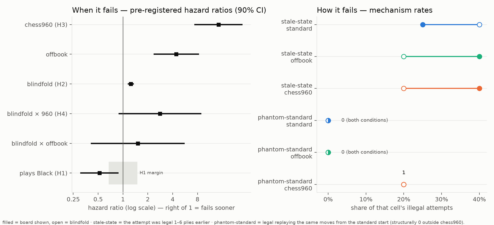
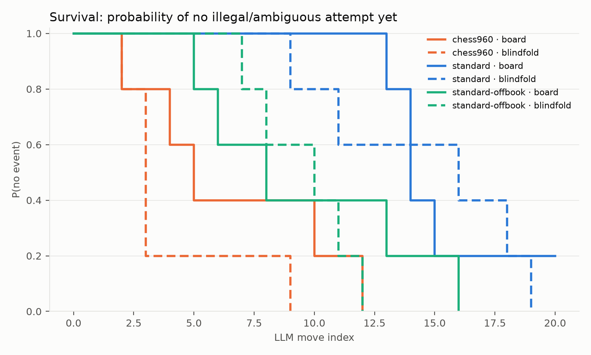
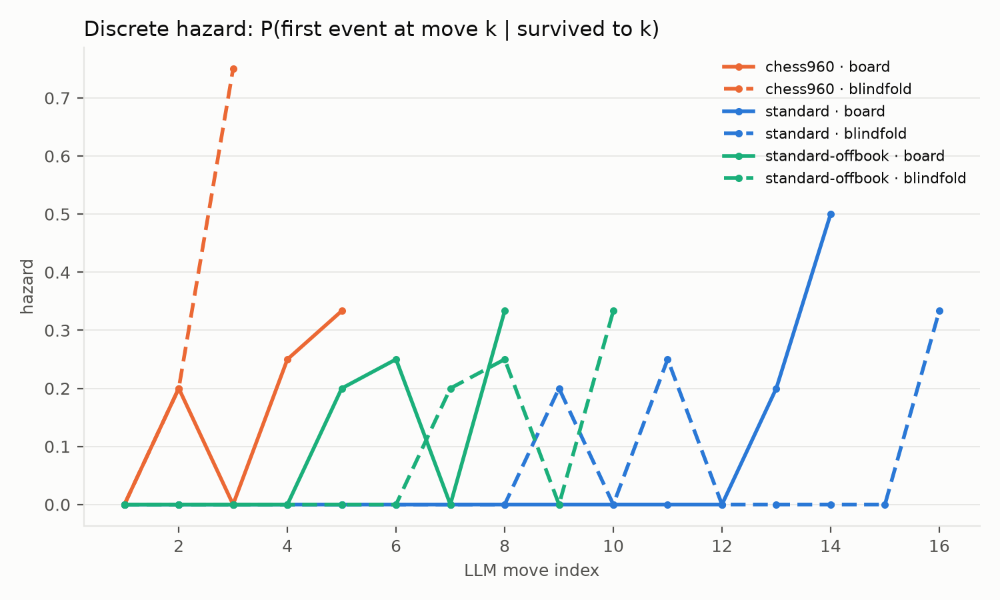

# chessbench analysis

Runs: runs/sonnet-nothink  
Games: 30 analyzable / 30 total · models: claude-code:sonnet

Pre-registered analysis per PLAN.md §7 (time scale: LLM move index; event: first illegal-or-ambiguous attempt).

## Per-cell summary

| cell | games | events | median event move | median exposure |
|---|---|---|---|---|
| chess960 × history+board | 5 | 5 | 5 | 5 |
| chess960 × history-only | 5 | 5 | 3 | 3 |
| standard × history+board | 5 | 4 | 14 | 14 |
| standard × history-only | 5 | 5 | 16 | 16 |
| standard-offbook × history+board | 5 | 5 | 8 | 8 |
| standard-offbook × history-only | 5 | 5 | 10 | 10 |

## Cox model (cause-specific, cluster-robust by position/prefix)

| covariate | log-HR | HR | 90% CI | p |
|---|---|---|---|---|
| blind | 0.219 | 1.24 | [1.14, 1.36] | 2.97e-05 |
| v960 | 2.664 | 14.35 | [7.32, 28.15] | 7.75e-11 |
| voffbook | 1.488 | 4.43 | [2.35, 8.36] | 0.000118 |
| blind_x_960 | 1.029 | 2.80 | [0.88, 8.89] | 0.143 |
| blind_x_offbook | 0.412 | 1.51 | [0.41, 5.61] | 0.605 |
| black | -0.656 | 0.52 | [0.30, 0.89] | 0.0443 |

H4 is the `blind_x_960` row: positive log-HR = blindfold hurts more in chess960 than in standard (the pattern-matching prediction).

_CIs: Wald intervals on log-HR with cluster-robust (sandwich) SEs clustered by start position/prefix, exp-transformed; 90% level chosen so the H1 equivalence test follows the TOST convention (90% CI inside the margin = alpha 0.05 equivalence)._

**H1 color equivalence:** HR(black) = 0.52, 90% CI [0.30, 0.89] vs margin [0.67, 1.5] → inconclusive (CI overlaps the margin boundary)

## Color control (White vs Black, per cell)

| cell | as White: n (events, median move) | as Black: n (events, median move) |
|---|---|---|
| chess960 × history+board | 3 (3 ev, med 5) | 2 (2 ev, med 8) |
| chess960 × history-only | 3 (3 ev, med 3) | 2 (2 ev, med 6) |
| standard × history+board | 3 (2 ev, med 14) | 2 (2 ev, med 14) |
| standard × history-only | 3 (3 ev, med 16) | 2 (2 ev, med 15) |
| standard-offbook × history+board | 3 (3 ev, med 6) | 2 (2 ev, med 12) |
| standard-offbook × history-only | 3 (3 ev, med 8) | 2 (2 ev, med 10) |

_Color is balanced within every cell and enters the Cox model as the `black` covariate; H1 (equivalence) above is the formal test._

## Censoring / termination by cause (per cell)

| cell | llm_illegal | move_cap |
|---|---|---|
| chess960 × history+board | 5 | 0 |
| chess960 × history-only | 5 | 0 |
| standard × history+board | 4 | 1 |
| standard × history-only | 5 | 0 |
| standard-offbook × history+board | 5 | 0 |
| standard-offbook × history-only | 5 | 0 |

_`llm_forfeit` rows with no illegal/ambiguous attempt are format forfeits (censoring); truncation is infrastructure censoring. Both are condition-correlated risks — watch these columns._

_No context-overflow attempts detected._

## Illegal-move error taxonomy

| cell | (phantom-standard) | (stale-state) | into-check-or-pin | own-piece-capture | piece-cannot-reach |
|---|---|---|---|---|---|
| chess960 × history+board | 1 | 2 | 0 | 0 | 5 |
| chess960 × history-only | 1 | 1 | 1 | 1 | 3 |
| standard × history+board | 0 | 1 | 0 | 1 | 3 |
| standard × history-only | 0 | 2 | 1 | 0 | 4 |
| standard-offbook × history+board | 0 | 2 | 0 | 0 | 5 |
| standard-offbook × history-only | 0 | 1 | 1 | 3 | 1 |

_`(phantom-standard)` counts chess960 illegal attempts that would have been LEGAL replaying the same movetext from the standard start — the direct signature of standard-geometry pattern matching. It is a conservative lower bound (the full history must replay from the standard array, so detection is biased toward the opening) and a structural zero outside chess960 (the reconstruction equals reality there), which makes the non-960 rows a built-in control. Both parenthesized classes are overlays on the base classes, so columns do not sum. `(stale-state)` counts attempts legal at a position 1–6 plies earlier — state-tracking lag; in board-shown cells these contradict the very board displayed in the prompt._

**Phantom-standard rate, eligibility-corrected.** The detector requires the game history to replay from the standard start, so it goes blind once a real chess960 move breaks the replay — models that survive longer have lower eligibility. Compare the rate among ELIGIBLE attempts across models, not raw counts:

| chess960 cell | illegal attempts | detector-eligible | phantom | rate of eligible |
|---|---|---|---|---|
| chess960 × history+board | 5 | 1 | 1 | 100% |
| chess960 × history-only | 5 | 2 | 1 | 50% |
## Sensitivity: illegal-only events

| cell | games | events | median event move |
|---|---|---|---|
| chess960 × history+board | 5 | 5 | 5 |
| chess960 × history-only | 5 | 5 | 3 |
| standard × history+board | 5 | 4 | 14 |
| standard × history-only | 5 | 5 | 16 |
| standard-offbook × history+board | 5 | 5 | 8 |
| standard-offbook × history-only | 5 | 5 | 10 |
