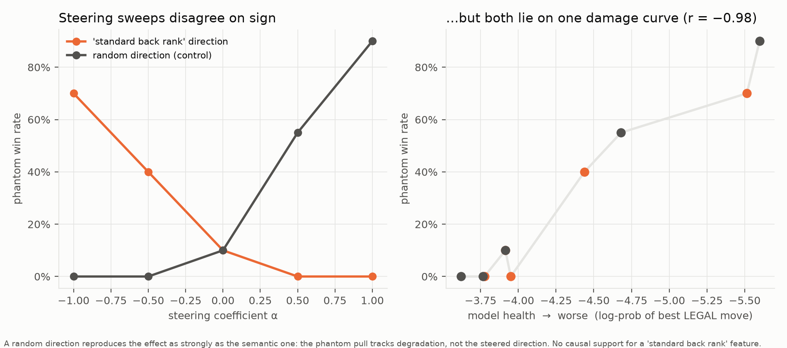

# Mechanistic follow-up: where do phantom-standard moves come from?

The benchmark finds that in Chess960 games, a quarter of first illegal
attempts are **phantom-standard** — moves that would have been legal on the
standard board. These experiments ask what produces them, using
`Qwen2.5-3B-Instruct` (the smallest tier we benchmarked, and the largest
that fits in 16 GB alongside hooks).

Isolated environment (torch/transformers conflict with the benchmark's
locked deps):

```sh
uv venv interp/.venv --python 3.12
VIRTUAL_ENV=interp/.venv uv pip install torch transformers accelerate numpy scikit-learn chess
interp/.venv/bin/python interp/phantom_probe.py     # gate
interp/.venv/bin/python interp/phantom_pull.py      # correlational
interp/.venv/bin/python interp/phantom_steer.py     # causal
```

All three import `chessbench`'s own prompt builders and parser, so there is
no prompt drift between the behavioural and interpretability arms.

## 1. Gate — does the hookable model reproduce the phenomenon?

`phantom_probe.py`, 48 Chess960 opening positions. **Yes**: 27 illegal
attempts, 4 phantom (15%, against 10% measured from the Q4-quantized ollama
build), every one of them `Nf3`, and **all four in the blindfold condition**
— independently replicating the benchmark's visibility effect on a
different serving stack and numeric precision.

## 2. Pull — the phantom is a permanent runner-up

Spontaneous phantoms are rare because the book move must beat every legal
alternative outright. `phantom_pull.py` instead scores *every* legal move
plus the classic book moves in 30 Chess960 positions × 2 visibility
conditions, and asks where the illegal book moves land.

| condition | rank of best **illegal** book move | top choice |
|---|---|---|
| blindfold | #2 in 17/30, #3 in 13/30 | `e4` (30/30) |
| board shown | #1 in 1/30, #2 in 16/30, #3 in 13/30 | `e4` (27/30), `Nf3` (3/30) |
| *standard start (baseline)* | — (`Nf3` is legal and ranks #1) | `Nf3` |

**In 60 of 60 position-conditions the best illegal book move ranked #2 or
#3 out of ~20 legal moves.** The model's opening preference is essentially
fixed: `Nf3` is its favourite from the standard array, and when the shuffle
makes `Nf3` impossible it does not get eliminated — it slides to second
place behind `e4`, the book move that survives the shuffle because pawns
are never shuffled. Observed phantoms are the tail of that distribution:
anything that perturbs the top-2 gap tips an illegal move into first place.

The pull is **the same size with the board shown** (rank distribution
16/13 vs 17/13). For this model, displaying the position does not reach the
move-preference computation — the mechanistic counterpart of the
benchmark's stale-state finding, where board-shown illegal attempts
contradict the very board printed in the prompt.

## 3. Steering — causal test (running)

`phantom_steer.py` extracts a **standard-back-rank direction** and adds or
subtracts it in the residual stream. The contrast avoids the obvious
confound: both classes use the identical Chess960 system prompt and format,
differing only in piece placement, because Chess960 position #518 *is* the
standard array.

    v = mean resid(sp 518) − mean resid(sp ≠ 518)

Predictions: **+α** strengthens the pull (illegal book moves climb, phantoms
on demand); **−α** weakens it (the model stops preferring impossible moves).

### 3a. First run was a no-op (caught, not reported)

The initial sweep returned byte-identical results at every α. That was not
a null result: the hook added the vector at position `-1`, while
`score_moves` reads logits at `[pre_len-1 : -1]` — the intervention landed
on the one position never read. Fixed (steer all positions, α scaled to the
measured residual norm), and the script now counts hook firings and
**hard-warns if the α sweep fails to move scores**, so a silent no-op can
never again be mistaken for a finding.

### 3b. The corrected sweep looks like damage, not a direction

With the hook working (effect spread 2.85), the α → phantom-pull curve is
**non-monotonic and backwards**: α = −3/−2 *raise* the pull (book wins
14/24), α = +2 *lowers* it (0/24), α = +3 raises it again (16/24). Large
perturbations in either direction appear to degrade the position-specific
computation, after which the model falls back on its prior — the opening
book. That is a real effect, but a much weaker (and confounded) claim than
"this direction encodes the standard board."

### 3c. The control kills the causal claim



Gentle sweep (α ±0.5, ±1) against a **random unit vector of the same norm**,
with model health logged as the log-prob of the best *legal* move:

| | α = −1 | −0.5 | 0 | +0.5 | +1 |
|---|---|---|---|---|---|
| **real direction** — health | −5.51 | −4.44 | −3.91 | −3.78 | −3.95 |
| **real direction** — phantom wins | 14/20 | 8/20 | 2/20 | 0/20 | 0/20 |
| **random direction** — health | −3.77 | −3.62 | −3.91 | −4.68 | −5.60 |
| **random direction** — phantom wins | 0/20 | 0/20 | 2/20 | 11/20 | 18/20 |

The two sweeps disagree about which sign of α raises the phantom pull — and
that is the tell. Plot phantom win rate against *model health* instead of α
and both collapse onto a single curve: **r = −0.976**. The random direction
reproduces the effect at least as strongly as the semantic one (18/20 at
health −5.60 vs 14/20 at −5.51).

**Conclusion: no causal support for a "standard back rank" feature.** What
the intervention actually shows is that degrading the model — in *any*
direction — makes it fall back on the opening book. That is consistent with
the memorization account in a weak sense (the book is what remains when
position-specific computation is disrupted), but it is emphatically not the
directional claim, and reporting it as one would have been wrong.

The correlational result (§2) stands on its own; the causal question is
open. Honest next steps: linear probes for board state (does the model
represent the *actual* back rank at all?), activation patching between
matched positions rather than mean-difference steering, and a layer sweep —
each with the random-direction control run alongside from the start.
